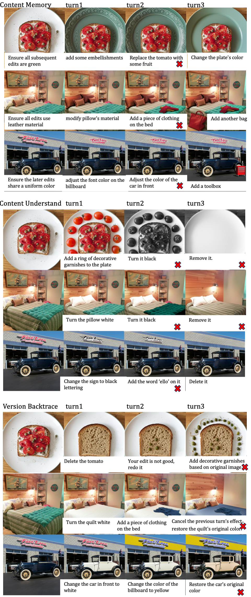

# Multi-Turn 
Multi-round editing tasks are divided into three categories: content understanding, content memory, and version backtracking. Each task has different editing instructions. The same type of editing instructions are saved in the same json file. Each instruction consists of 2-3 sub-instructions, which are executed in sequence to generate multiple edited images. And through multi-round editing tasks, we run these tests manually and judge by manual judgment.


## Input
The benchmark images can be downloaded from huggingface [Benchmark.tar](https://huggingface.co/datasets/sysuyy/ImgEdit/blob/main/Benchmark.tar)

A JSON file containing image edit instructions

```json
{
    "1":{"id": "000066341.jpg", "turn1": "Ensure all subsequent edits are green, add some embellishments in the empty area of the plate", "turn2": "Replace the tomato with some fruit", "turn3": "Change the plate's color"}
}
```


## Output
**Multi-turn Cases of GPT-4o:**


**Multi-turn Cases of Gemini-2.5-flash:**
