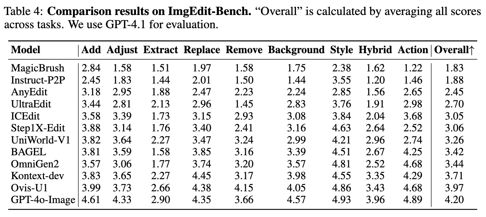

<h1 align="center" style="line-height: 50px;">
  ImgEdit: A Unified Image Editing Dataset and Benchmark
</h1>


<div align="center">
Yang Ye<sup>1,3</sup>*, Xianyi He<sup>1,3</sup>*, Zongjian Li<sup>1,3</sup>*, Bin Lin<sup>1,3</sup>*, Shenghai Yuan<sup>1,3</sup>*, 

Zhiyuan Yan<sup>1</sup>*, Bohan Hou<sup>1</sup>, Li Yuan<sup>1,2</sup>
 


<sup>1</sup>Peking University, Shenzhen Graduate School, <sup>2</sup>Peng Cheng Laboratory, <sup>3</sup>Rabbitpre AI

\*Equal Contribution. 

[](http://arxiv.org/abs/2505.20275)
[](https://huggingface.co/datasets/sysuyy/ImgEdit)
[](https://huggingface.co/datasets/sysuyy/ImgEdit_recap_mask)
</div>

<br>

<details open><summary>💡 We also have other image edit projects that may interest you ✨. </summary><p>
<!--  may -->

> [**UniWorld-V1: High-Resolution Semantic Encoders for Unified Visual Understanding and Generation**](https://arxiv.org/abs/2506.03147) <br>
> Bin Lin and Zongjian Li, etc. <br>
[](https://github.com/PKU-YuanGroup/UniWorld-V1)  [](https://github.com/PKU-YuanGroup/UniWorld-V1) [](https://arxiv.org/abs/2506.03147) <br>
> </p></details>


# 🌍 Introduction
**ImgEdit** is a large-scale, high-quality image-editing dataset comprising 1.2 million carefully curated edit pairs, which contain both novel and complex single-turn edits, as well as challenging multi-turn tasks.

To ensure the data quality, we employ a multi-stage pipeline that integrates a cutting-edge vision-language model, a detection model, a segmentation model, alongside task-specific in-painting procedures and strict post-processing. ImgEdit surpasses existing datasets in both task novelty and data quality.

Using ImgEdit, we train **ImgEdit-E1**, an editing model using Vision Language Model to process the reference image and editing prompt, which outperforms existing open-source models on multiple tasks, highlighting the value of ImgEdit and model design.

For comprehensive evaluation, we introduce **ImgEdit-Bench**, a benchmark designed to evaluate image editing performance in terms of instruction adherence, editing quality, and detail preservation.
It includes a basic testsuite, a challenging single-turn suite, and a dedicated multi-turn suite.
We evaluate both open-source and proprietary models, as well as ImgEdit-E1.

# 🔥 News
- [2025.07.27] We update our leaderboard [here](#jump), add ICEdit, BAGEL, OmniGen2, Flux-Kontext-dev and Ovis-U1 on ImgEditBench.
- [2025.06.24] We update some results of [ImgEdit-Bench](https://github.com/PKU-YuanGroup/ImgEdit#%EF%B8%8F-imgedit-bench), including **BAGEL** and **Uniworld-V1**.
- [2025.06.03] We have open-sourced **UniWorld-V1**, which inherits the powerful editing capabilities of **ImgEdit-E1**. It is trained on 700K subset of ImgEdit. For more details, please refer to https://github.com/PKU-YuanGroup/UniWorld-V1.
- [2025.05.26] We have finished upload the ImgEdit datasets together with original dataset.
### TODO
- [x] Release ImgEdit datasets.
- [x] Release ImgEdit original dataset(with dense caption, object-level bounding box and object-level segmentation mask).
- [ ] Release data curation pipelines.
- [x] Release benchmark datasets.

# 💡 ImgEdit Dataset
## 📣 Overview
### Data statistic


### Single Turn tasks and Multi-Turn tasks
We comprehensively categorize single-turn image editing tasks into 10 tasks and multi-turn image editing tasks into 3 tasks. 


We provide some cases from our dataset.


# 🖥️  ImgEdit Pipeline 

1. Data Preparation & Filter (using Laion-aes dataset, only retain samples with aesthetic score greater than 4.75, then use Qwen2.5VL-7B to generate dense caption and use GPT-4o to generate short caption.)
2. Generate bounding box and segamentation mask (using [Yolo-world](https://github.com/AILab-CVC/YOLO-World) and [SAM2](https://github.com/facebookresearch/sam2)) and filter with CLIP.
3. Generate diverse edit prompts using GPT-4o
4. Task-based editing pipelines using ComfyUI
5. Data Quality Filter using GPT-4o
We provide dataset after segamentation, since it maybe a good dataset to train other models(VLMs)

## ⚖️  Data Format
**Preprocess Data Json Format**

See the [rle_to_mask](inpaint-workflow/imgedit/utils/mask.py) to convert string-type mask into image.
  ```python
    {
        "path": "00095/00019/000197953.jpg", # image path
        "cap": [
            "The image depicts a couple dressed in wedding attire standing on a rocky cliff overlooking ..."
        ],  # dense caption provided by Qwen2.5-VL-7B
        "resolution": {
            "height": 1333,
            "width": 2000
        },  # resolution of the image
        "aes": 6.132755279541016, # aesthetic score of the image
        "border": [
            176
        ], # useless
        "tags": {
            "background": [
                "ocean",
                "sky",
                ...
            ], # background nouns, extracted by gpt4o from dense caption
            "object": [
                "bride",
                "bow tie"
                ...
            ], # object nouns, extracted by gpt4o from dense caption
            "summary": "A couple in wedding attire poses on a rocky cliff overlooking a scenic ocean, creating a romantic coastal setting." # short caption sumarrized by gpt4o from dense caption
        },
        "segmentation": {
            "background": [
                {
                    "class_name": "sky",
                    "bbox": [
                        0.505828857421875,
                        1.1066421270370483,
                        2000.0,
                        738.3450317382812
                    ], # yoloworld bbox
                    "mask": "xxx..", # mask provided with string
                    "score": 0.9921875, # yoloworld score
                    "clip_score": 0.9597620368003845, # clip score for the corresponding area
                    "aes_score": 4.34375 # score of the corresponding area
                },
                {
                    "class_name": "ocean",
                    ...
                },
                ...
            ],
            "object": [
                {
                    "class_name": "bride", 
                    ...
                },
                {
                    "class_name": "bow tie",
                    ...
                },
                {
                    "class_name": "bow tie",
                    ...
                },
            ...
            ],
            "box_format": "xyxy"
        },
        "bg_count": {
            "ocean": 1,
            "sky": 1,
            ...
        }, # count the same object and background name 
        "obj_count": {
            "bow tie": 2,
            "bride": 1,
            ...
        }
    }
  ```
**ImgEdit Dataset Format**

The final ImgEdit dataset are in parquet format, the input and output images can be found in .tar files.
```python
from datasets import load_dataset
ds = load_dataset("parquet", data_files="./remove_part5.parquet")
print(ds['train'][0])
# {'input_images': ['results_remove_laion_part5/00094_00030_000304748/original.png'], 'output_images': ['results_remove_laion_part5/00094_00030_000304748/result.png'], 'prompt': 'Remove the group of people snowshoeing in winter clothing located in the far-right upper-middle of the image.'}
```

For multi-turn dataset:
```python
from datasets import load_dataset
ds = load_dataset("parquet", data_files="./version_backtracking_part0.parquet")
print(ds['train'][0])
# {'data': [{'input_images': ['results_version_backtracking_part0/00031_00020_000209651/origin_0.png'], 'output_images': ['results_version_backtracking_part0/00031_00020_000209651/result_0.png'], 'prompt': 'add a green vest in the middle-right area of the image, covering a torso sized approximately from mid-waist to chest'}, {'input_images': ['results_version_backtracking_part0/00031_00020_000209651/origin_1.png'], 'output_images': ['results_version_backtracking_part0/00031_00020_000209651/result_1.png'], 'prompt': 'replace the green vest with a brown leather jacket'}, {'input_images': ['results_version_backtracking_part0/00031_00020_000209651/origin_2.png'], 'output_images': ['results_version_backtracking_part0/00031_00020_000209651/result_2.png'], 'prompt': 'withdraw the previous round of modifications, adjust the green vest in round1 to have a brighter shade of green and a subtle quilted texture'}]}
```

## 🧳 Download Dataset

**Preprocess Dataset**
```python
- ImgEdit_recap_mask/
  - laion-aes/ #  tar files with filtered laion-aes image
    - 00000.tar 
    - ...
  - jsons/ #  jsons with caption, bbox, and mask
    - part0.tar
    - ...
```
**ImgEdit Dataset**
```python
- ImgEdit/
  - Multiturn/ #  multi turn image data
    - results_content_memory_part2.tar.split.000
    - ...
  - Singleturn/ #  single turn image data
    - action_part1.tar.split.000
    - ...
  - Parquet/ #  prompts and image paths for all tasks 
    - add_part0.parquet
    - ...
  - ImgEdit_judge/ # model checkpoint in Qwen2.5-VL format
      - config.json
      - model-00001-of-00004.safetensors
      - ...
  - all_dataset_gpt_score.json # all postprocess score 
  - Benchmark.tar # dataset for benchmark
```
We release both preprocess dataset and imgedit dataset. The dataset is available at HuggingFace, or you can download it with the following command. Some samples can be found on our paper and github. 
```
huggingface-cli download --repo-type dataset \
sysuyy/ImgEdit \
--local-dir ...

huggingface-cli download --repo-type dataset \
sysuyy/ImgEdit_recap_mask \
--local-dir ...
```
tar packages are spiltted into pieces, use `cat a.tar.split.* > a.tar` to merge them.
## 🛠️ Setups for ImgEdit pipeline

WIP


# 🎖️ ImgEdit-Bench
**ImgEdit-Bench** consists of three key components: a basic editing suite that evaluates instruction adherence, editing quality, and detail preservation across a diverse
range of tasks; an Understanding-Grounding-Editing (UGE) suite, which increases task complexity
through challenging instructions (e.g., spatial reasoning and multi-object targets) and complex scenes
such as multi-instance layouts or camouflaged objects; and a multi-turn editing suite, designed to
assess content understanding, content memory, and version backtracking. 
<span id="jump"></span>



**More Quantitative Cases:**


## ⚒️ Setups for ImgEdit-Bench
**Basic-Bench**:
See [Basic_bench](Benchmark/Basic/basic_bench_readme.md) for details.

**Understanding-Grounding-Editing(UGE)-Bench**:
See [UGE_bench](Benchmark/UGE/UGE_bench_readme.md) for details.

**Multi-Turn-Bench**:
See [Multiturn_bench](Benchmark/Multiturn/Multiturn_readme.md) for details and more cases.

## ⚒️ Setups for ImgEdit-Judge

1. You should setup your environment following [Qwen2.5-VL](https://github.com/QwenLM/Qwen2.5-VL)
2. Download the ImgEdit_Judge checkpoint from huggingface.
3. We give a demo code as follow, you should change the prompt with the corresponding tasks in [prompts.json](Benchmark/Basic/prompts.json) to get the best performance. 
```python
import torch
from transformers import Qwen2_5_VLForConditionalGeneration, AutoProcessor
from qwen_vl_utils import process_vision_info
prompt = ""
# Load the processor

# Load the model with recommended configurations
model = Qwen2_5_VLForConditionalGeneration.from_pretrained(
    # "/mnt/workspace/yangye/Qwen2.5-VL-7B-Instruct",
    "ImgEdit_Judge/checkpoint/path",
    torch_dtype=torch.bfloat16,
    attn_implementation="flash_attention_2",
    device_map="auto",
    local_files_only=True,
)
min_pixels = 1016064  # we train our model with this settings
max_pixels = 1354752  # we train our model with this settings
processor = AutoProcessor.from_pretrained("ImgEdit_Judge/checkpoint/path", min_pixels=min_pixels, max_pixels=max_pixels)  

messages = [
        {
            "role": "user",
            "content": [
                {"type": "text", "text": prompt.replace("<edit_prompt>", edit_prompt)},
                {"type": "image", "image": original_path},
                {"type": "image", "image": result_path},
            ],
        }
    ]

    # Prepare for inference
    text = processor.apply_chat_template(
        messages, tokenize=False, add_generation_prompt=True
    )
    image_inputs, video_inputs = process_vision_info(messages)
    inputs = processor(
        text=[text],
        images=image_inputs,
        videos=video_inputs,
        padding=True,
        return_tensors="pt",
    )
    inputs = inputs.to(model.device)

    # Inference: Generation of the output
    generated_ids = model.generate(**inputs, max_new_tokens=2048)
    generated_ids_trimmed = [
        out_ids[len(in_ids) :] for in_ids, out_ids in zip(inputs.input_ids, generated_ids)
    ]
    output_text = processor.batch_decode(
        generated_ids_trimmed, skip_special_tokens=True, clean_up_tokenization_spaces=False
    )
```
# 👍 Acknowledgement

This project wouldn't be possible without the following open-sourced repositories: [Open-Sora Plan](https://github.com/PKU-YuanGroup/Open-Sora-Plan), [Grounded-SAM-2](https://github.com/IDEA-Research/Grounded-SAM-2), [improved-aesthetic-predictor](https://github.com/christophschuhmann/improved-aesthetic-predictor), [Qwen2.5-VL](https://github.com/QwenLM/Qwen2.5-VL), [YOLO-World](https://github.com/AILab-CVC/YOLO-World), [Laion-dataset](https://github.com/LAION-AI/laion-datasets), [ComfyUI](https://github.com/comfyanonymous/ComfyUI), [Stable Diffusion](https://huggingface.co/stabilityai/stable-diffusion-xl-base-1.0), and [Flux](https://github.com/black-forest-labs/flux).

# 📜 Citation
If you find our paper and code useful in your research, please consider giving a star ⭐ and citation 📝.
```bibtex
@article{ye2025imgedit,
  title={Imgedit: A unified image editing dataset and benchmark},
  author={Ye, Yang and He, Xianyi and Li, Zongjian and Lin, Bin and Yuan, Shenghai and Yan, Zhiyuan and Hou, Bohan and Yuan, Li},
  journal={arXiv preprint arXiv:2505.20275},
  year={2025}
}
@article{lin2025uniworld,
  title={UniWorld: High-Resolution Semantic Encoders for Unified Visual Understanding and Generation},
  author={Lin, Bin and Li, Zongjian and Cheng, Xinhua and Niu, Yuwei and Ye, Yang and He, Xianyi and Yuan, Shenghai and Yu, Wangbo and Wang, Shaodong and Ge, Yunyang and others},
  journal={arXiv preprint arXiv:2506.03147},
  year={2025}
}
```


