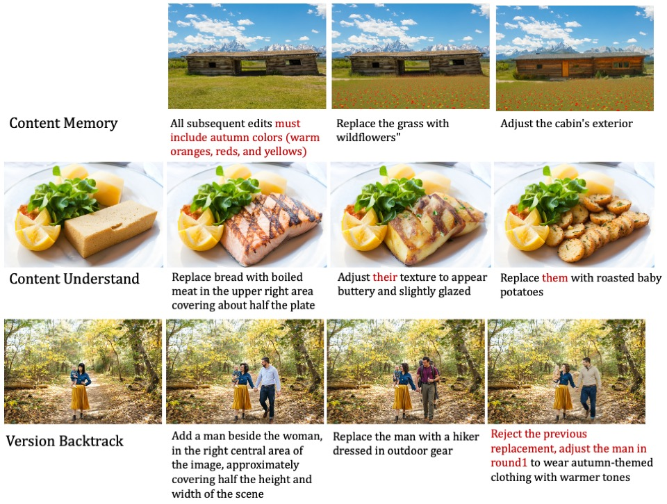

<h1 align="center" style="line-height: 50px;">
  <!--  -->
  ImgEdit: A Unified Image Editing Dataset and Benchmark
</h1>


<div align="center">
Yang Ye<sup>1,3</sup>*, Xianyi He<sup>1,3</sup>*, Zongjian Li<sup>1,3</sup>*, Bin Lin<sup>1,3</sup>*, Shenghai Yuan<sup>1,3</sup>*, 

Zhiyuan Yan<sup>1</sup>*, Bohan Hou<sup>1</sup>, Li Yuan<sup>1,2</sup>
 


<sup>1</sup>Peking University, Shenzhen Graduate School, <sup>2</sup>Peng Cheng Laboratory, <sup>3</sup>Rabbitpre AI

\*Equal Contribution. 

[](https://arxiv.org/)
[](https://huggingface.co/datasets/sysuyy/ImgEdit)
[](https://huggingface.co/datasets/sysuyy/ImgEdit_recap_mask)
<!-- [](https://github.com/DCDmllm/AnyEdit)
[](https://github.com/weichow23/AnySD)
[](https://dcd-anyedit.github.io/) -->
</div>

# 🌍 Introduction
**ImgEdit** is a large-scale, high-quality image-editing dataset comprising 1.2 million carefully curated edit pairs, which contain both novel and complex single-turn edits, as well as challenging multi-turn tasks.
To ensure the data quality, we employ a multi-stage pipeline that integrates a cutting-edge vision-language model, a detection model, a segmentation model, alongside task-specific in-painting procedures and strict post-processing. ImgEdit surpasses existing datasets in both task novelty and data quality.
Using ImgEdit, we train **ImgEdit-E1**, an editing model using Vision Language Model to process the reference image and editing prompt, which outperforms existing open-source models on multiple tasks, highlighting the value of ImgEdit and model design.
For comprehensive evaluation, we introduce **ImgEdit-Bench**, a benchmark designed to evaluate image editing performance in terms of instruction adherence, editing quality, and detail preservation.
It includes a basic testsuite, a challenging single-turn suite, and a dedicated multi-turn suite.
We evaluate both open-source and proprietary models, as well as ImgEdit-E1.
# 🔥 News
- [2025.05.26] We have finished upload the ImgEdit datasets together with original dataset.
### TODO
- [x] Release ImgEdit datasets.
- [x] Release ImgEdit original dataset(with dense caption, object-level bounding box and object-level segmentation mask).
- [ ] Release data curation pipelines.
- [x] Release benchmark datasets.

# 💡 Overview


We comprehensively categorize single-turn image editing tasks into 10 tasks and multi-turn image editing tasks into 3 tasks. We provide some cases from our dataset.



# 🖥️  ImgEdit Datapipeline 

1. Data Preparation & Filter (using Laion-aes dataset, only retain samples with aesthetic score greater than 4.75, then use Qwen2.5VL-7B to generate dense caption and use GPT-4o to generate short caption.)
2. Generate bounding box and segamentation mask (using [Yolo-world](https://github.com/AILab-CVC/YOLO-World) and [SAM2](https://github.com/facebookresearch/sam2))
3. Generate diverse edit prompts using GPT-4o
4. Task-based editing pipelines using ComfyUI
5. Data Quality Filter using GPT-4o
We provide dataset after segamentation, since it maybe a good dataset to train other models(VLMs)
### Original Data Json Format and Example


  ```python
    {
        "path": "00095/00019/000197953.jpg", # image path
        "cap": [
            "The image depicts a couple dressed in wedding attire standing on a rocky cliff overlooking the ocean. The bride is wearing a long, white, lace gown with an open back, while the groom is dressed in a white suit with a bow tie. They are positioned apart, facing different directions, with the bride looking out to sea and the groom looking towards the bride. The background features a scenic ocean view with distant islands and a clear blue sky with some scattered clouds. The overall setting suggests a romantic, outdoor wedding scene with a natural, coastal environment. The style of the image is photorealistic, capturing the details of the attire and the landscape."
        ],  # dense caption provided by Qwen2.5-VL-7B
        "resolution": {
            "height": 1333,
            "width": 2000
        },  # resolution of the image
        "aes": 6.132755279541016, # aesthetic score
        "border": [
            176
        ], # useless
        "tags": {
            "background": [
                "ocean",
                "sky",
                ...
            ], # background nouns, extracted by gpt4o from dense caption
            "object": [
                "couple",
                "wedding attire",
                "bride",
                "gown",
                "back",
                "groom",
                "suit",
                "bow tie"
            ], # object nouns, extracted by gpt4o from dense caption
            "summary": "A couple in wedding attire poses on a rocky cliff overlooking a scenic ocean, creating a romantic coastal setting." # short caption sumarrized by gpt4o from dense caption
        },
        "segmentation": {
            "background": [
                {
                    "class_name": "sky",
                    "bbox": [
                        0.505828857421875,
                        1.1066421270370483,
                        2000.0,
                        738.3450317382812
                    ], # yoloworld bbox
                    "mask": "xxx..", # mask provided with string
                    "score": 0.9921875, # yoloworld score
                    "clip_score": 0.9597620368003845, # clip score for the corresponding area
                    "aes_score": 4.34375 # score of the corresponding area
                },
                {
                    "class_name": "ocean",
                    "bbox": [
                        0.0,
                        722.9654541015625,
                        1455.8074951171875,
                        839.5341796875
                    ],
                    "mask": "kf0X2]W1000000000...",
                    "score": 0.77734375,
                    "clip_score": 0.9553191661834717,
                    "aes_score": 4.703125
                },
                ...
            ],
            "object": [
                {
                    "class_name": "bride", 
                    "bbox": [
                        931.7371826171875,
                        339.7152404785156,
                        1500.1824951171875,
                        1220.9635009765625
                    ],
                    "mask": "iRVV1...",
                    "score": 0.98828125,
                    "clip_score": 0.7853191661834717,
                    "aes_score": 4.44296875
                },
                {
                    "class_name": "bow tie",
                    "bbox": [
                        538.6561279296875,
                        620.267822265625,
                        576.147216796875,
                        646.4366455078125
                    ],
                    "mask": "kQie02aY13M2L5N3N1N2O1OO2O0O2O0O2O001N0101N10001N10001O0O2O001N2O0O2O0000O2O0O1DWgNImX10`PQj1",
                    "score": 0.80859375,
                    "clip_score": 0.6553191661834717,
                    "aes_score": 4.33296875
                },
                {
                    "class_name": "bow tie",
                    "bbox": [
                        534.9696044921875,
                        640.4915771484375,
                        551.0680541992188,
                        667.6270141601562
                    ],
                    "mask": "hhge0;UY18L2O1N101O001O0001O1N3M5L;CcVPk1",
                    "score": 0.83203125,
                    "clip_score": 0.5653191661834717,
                    "aes_score": 4.43296875
                },
            ...
            ],
            "box_format": "xyxy"
        },
        "bg_count": {
            "ocean": 1,
            "sky": 1,
            ...
        }, # count the same object name 
        "obj_count": {
            "bow tie": 2,
            "bride": 1,
            ...
        }
    }
  ```
The final ImgEdit dataset are in parquet format, the input and output images can be found in huggingface repo with the same name.
```python
from datasets import load_dataset
ds = load_dataset("parquet", data_files="./remove_part5.parquet")
print(ds['train'][0])
# {'input_images': ['results_remove_laion_part5/00094_00030_000304748/original.png'], 'output_images': ['results_remove_laion_part5/00094_00030_000304748/result.png'], 'prompt': 'Remove the group of people snowshoeing in winter clothing located in the far-right upper-middle of the image.'}
```

For multi-turn dataset:
```python
from datasets import load_dataset
ds = load_dataset("parquet", data_files="./version_backtracking_part0.parquet")
print(ds['train'][0])
# {'data': [{'input_images': ['results_version_backtracking_part0/00031_00020_000209651/origin_0.png'], 'output_images': ['results_version_backtracking_part0/00031_00020_000209651/result_0.png'], 'prompt': 'add a green vest in the middle-right area of the image, covering a torso sized approximately from mid-waist to chest'}, {'input_images': ['results_version_backtracking_part0/00031_00020_000209651/origin_1.png'], 'output_images': ['results_version_backtracking_part0/00031_00020_000209651/result_1.png'], 'prompt': 'replace the green vest with a brown leather jacket'}, {'input_images': ['results_version_backtracking_part0/00031_00020_000209651/origin_2.png'], 'output_images': ['results_version_backtracking_part0/00031_00020_000209651/result_2.png'], 'prompt': 'withdraw the previous round of modifications, adjust the green vest in round1 to have a brighter shade of green and a subtle quilted texture'}]}
```

# 🛠️ Setups for ImgEdit pipeline

WIP

# 🧳 Huggingface Folder Structure
```python
- ImgEdit/
  - Multiturn/ #  multi turn image data
    - results_content_memory_part2.tar.split.000
    - ...
  - Singleturn/ #  single turn image data
    - action_part1.tar.split.000
    - ...
  - Parquet/ #  prompts and image paths for all tasks 
    - add_part0.parquet
    - ...
  - ImgEdit_judge/ # model checkpoint in Qwen2.5-VL format
      - config.json
      - model-00001-of-00004.safetensors
      - ...
  - all_dataset_gpt_score.json # all postprocess score 

```
# 🎖️ ImgEdit-Bench Results
ImgEdit-Bench, consisting of three key components: a basic editing suite that evaluates instruction adherence, editing quality, and detail preservation across a diverse
range of tasks; an Understanding-Grounding-Editing (UGE) suite, which increases task complexity
through challenging instructions (e.g., spatial reasoning and multi-object targets) and complex scenes
such as multi-instance layouts or camouflaged objects; and a multi-turn editing suite, designed to
assess content understanding, content memory, and version backtracking. 

More cases:

Multi-turn cases of GPT-4o:

Multi-turn cases of Gemini-2.5-flash:


## Basic-Bench
See the [basic_bench](Benchmark/Basic/basic_bench_readme.md) for details.

## Understanding-Grounding-Editing(UGE)-Bench
See the [UGE_bench](Benchmark/UGE/UGE_bench_readme.md) for details.

## Multi-Turn-Bench
See the [multiturn_bench](Benchmark/Multiturn/Multiturn_readme.md) for details.

# 👨‍⚖️ ImgEdit-Judge


# 📜 Citation
If you find this work useful for your research, please cite our paper and star our git repo:
```bibtex

```


